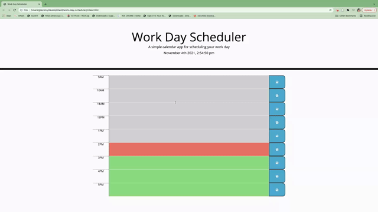

# work-day-scheduler

## Description
This is a simple calendar application that allow users to save events for each hour of the day. The app runs in the browser and dynamically updated HTML and CSS powered by jQuery. 

## Demo

## Built with
* HTML
* CSS
* JavaScript

## Third Party Libraries
* Bootstrap
* JQuery

## Website
URL: https://mavisyupyup1.github.io/work-day-scheduler/

## Contribution
URl: https://github.com/coding-boot-camp/super-disco
